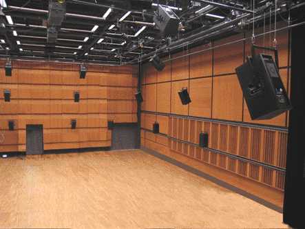

Zirkonium Spatialization Server
==============================

ZKM | Hertz-lab

Dr. Chikashi Miyama 2015-2017 (version 1)  
Dan Wilcox 2018-2019 (version 2 update)

Overview
--------

This software is the rendering server for 3D sound spatialization that ZKM | Hertz-Lab employs for its 3D surround audio system, the Klangdom (Sound Dome).

The software is programmed in [PureData](https://puredata.info), an open source visual programming language by Miller Puckette.

This engine is embedded in [Zirkonium3](http://zkm.de/zirkonium), a toolkit for spatial composition and performance, employing libpd.

Dependencies
------------

To open the patch files, you will need [Pure Data](https://puredata.info).

The server uses customized versions of the following spatilization external objects:
* VBAP (Vector-Based Amplitude Panning) by Ville Pukki: <http://legacy.spa.aalto.fi/research/cat/vbap/>
* HOA (Higher-Order Ambisonics) from the Hoa library by the CICM: <http://hoalibrary.mshparisnord.fr/en>
* earplug~ realtime binaural filter (used for HRTF modeling) by Pei Xiang: <https://puredata.info/downloads/earplug>

See the README files in the individual external directories for details.

Build
-----

The source files for the [zirkhoa], [zirkhrtf\~], and [zirkvbap] external libraries are included in the `externals` directory and can be built using the main Makefile or the Makefiles in the individual external directories.

Make sure you have git and a copy of Pure Data installed to your system.

Compile with:

    make

Each external will be built and the compiled object and it's help file will be copied into the main directory.

To clean temporary build files but keep the compiled externals:

    make clean

To remove the compiled externals:

    make clobber

Control Messages
----------------

Receiving:

* transport
  - start
  - stop
  - time _float_ (position offset in seconds, 0 start)
  - poll _bool_ (0 or 1, send poll messages on audio blocks?)
  - refresh _float_ (fps, set poll block size based on desired fps)
* samplerate _rate_
* layout
  - _dimension_ _positions_ (dimension: 2 or 3, forwards to zirk_ids)
    + 2D: 2 _azimuth1_ _azimuth2_ ...
    + 3D: 3 _azimuth1_ _elevation1_ _azimuth2_ _elevation2_ ...
  - transform _bool_: (0 or 1, apply rotate or flip transforms?)
  - rotate _float_: (rotate speaker positions in degrees)
  - flip _bool_: (0 or 1, speaker position vertical flip)
* input (channel 1 - n or "all")
  - _channel_ _float_ (rms gain 0-1)
  - _channel_ db _float_ (db gain -100 - +12)
  - _channel_ gain _float_ (alias for db message)
* sourcefile (id 1 - n or "all")
  - _id_ _float_ (rms gain 0 - 1)
  - _id_ db _float_ (db gain -100 - +12)
  - _id_ gain _float_ (alias for db message)
  - _id_ open _filepath_
  - _id_ open _filepath_ _offset_ (optional sample offset, see [readsf~])
  - _id_ start (requires "open" message first)
  - _id_ stop
* id (id 1 - n or "all", 0 is test id)
  - _id_ _float_ (rms gain 0 - 2)
  - _id_ db _float_ (db gain -100 - +12)
  - _id_ gain _float_ (alias for db message)
  - _id_ on _bool_ (0 or 1)
  - _id_ input _input_ (zirk_input # or symbol, 0 or "none" disables input)
  - _id_ position _x_ _y_ _z_ (spherical cartesian position, -1 to 1, 0 center)
  - _id_ span _span_ (0 - 1)
  - _id_ mute _bool_ (0 or 1)
  - _id_ muted _bool_ (alias for "mute")
  - _id_ algorithm _algo_ ("VBAP", "vbap", "HOA", or "hoa")
  - _id_ optim _optim_ (HOA optimization: "basic", "maxre", or "inphase")
  - _id_ directoutput _output_ (zirk_speaker # or symbol, 0 or "none" disables output)
  - _id_ directout _output_ (alias for "directoutput")
  - _id_ layout _dimension_ _positions_ (dimension: 2 or 3)
    + 2D: 2 _azimuth1_ _azimuth2_ ...
    + 3D: 3 _azimuth1_ _elevation1_ _azimuth2_ _elevation2_ ...
  - _id_ vbap speed _ms_ (default 25)
  - _id_ hoa speed _ms_ (default 25)
  - _id_ hrtf _bool_ (bypass to HRTF?, 0 or 1)
  - _id_ hrtf speed _ms_ (default 25)
  - _id_ report level _bool_ (0 or 1, output pre-level db?)
  - _id_ report current _bool_ (0 or 1, output current vbap speaker set?)
  - 0 noise _float_ (test sound noise type: 0 - pink, 1 - white)
* speaker (id 1 - n or "all")
  - _id_ _float_ (rms gain 0 - 1)
  - _id_ db _float_ (db gain -100 - +12)
  - _id_ gain _float_ (alias for db message)
  - _id_ on _bool_ (enable DSP, 0 or 1)
  - _id_ delay _float_ (delay time in ms)
  - _id_ phase _bool_ (invert audio phase?, 0 or 1)
  - _id_ output _output_ (zirk_output # or symbol)
  - _id_ record open _filepath_
  - _id_ record open -bytes 3 _filepath_ (forces 24 bit output, see [writesf~])
  - _id_ record start (requires "open" message first)
  - _id_ record stop
  - _id_ report level _bool_ (0 or 1)
* output (channel 1 - n or "all")
  - _channel_ _float_ (rms gain 0 - 1)
  - _channel_ db _float_ (-100 - +12)
  - _channel_ gain _float_ (alias for "db" message)
* hrtf (stereo output)
  - _float_ (rms gain 0 - 1)
  - db _float_ (-100 - +12)
  - gain _float_ (alias for "db" message)
  - on _bool_ (0 or 1, forwards to all zirk_ids)
  - output 1 _channel_ (hardware output # for left, default 1)
  - output 2 _channel_ (hardware output # for right, default 2)
  - record open _filepath_
  - record start (requires "open" message first)
  - record stop
  - report level _bool_ (0 or 1)

Sending:

* poll
* time _time in seconds_
* level
  - id _id_ _float_ (db -100 to +12)
  - speaker _id_ _float_ (db -100 to +12)
* vbap
  - set (speaker layout set)
    + 2D pair: set _speaker1_ _speaker2_
    + 3D triplet: set _speaker1_ _speaker2_ _speaker3_
  - current _id_ _set_ (current speaker set)

Messaging
---------

* \#zirk-in: server receive (input)
* \#zirk-out: server send (ouput)
* audio signals:
  - zirk_input\#: hardware input channel, ie. zirk_input1, zirk_input2, ...
  - zirk_sf\#-\#: sourcefile & audio channel, ie. zirk_sf1-1, zirk_sf1-2, zirk_sf2-4, ...
  - zirk_speaker\#: virtual speaker, ie. zirk_speaker1, zirk_speaker2, ...
  - zirk_output\#: hardware output channel, ie. zirk_output1, zirk_output2, ...
  - zirk_hrtf1 & zirk_hrtf2: hrtf hardware output channels (left & right)

Contribution
------------

If you find a bug, please file it as an issue.
